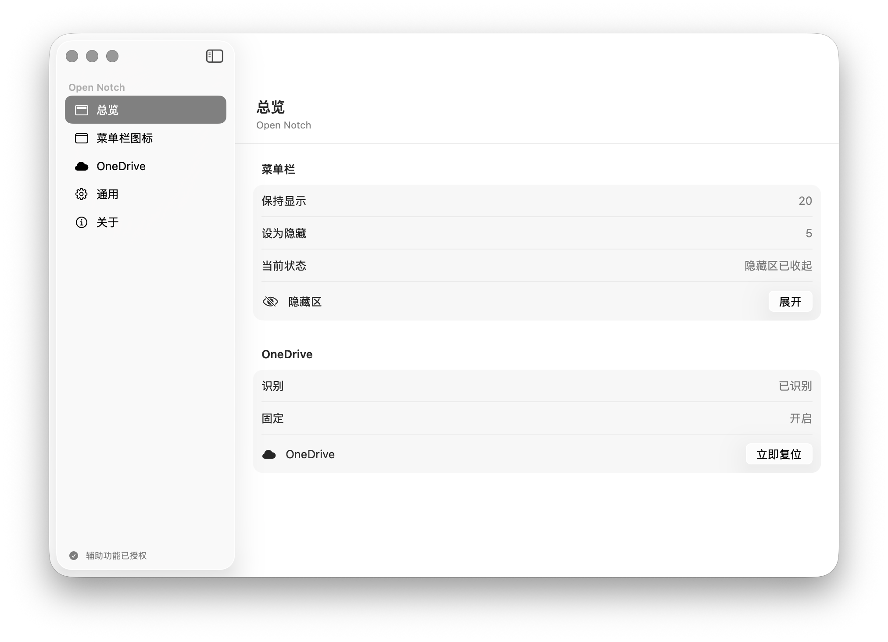
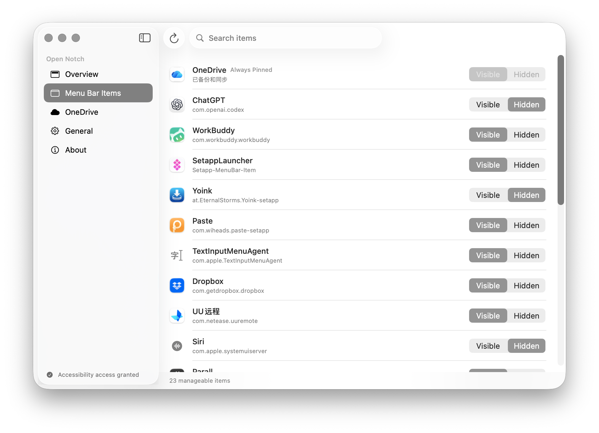
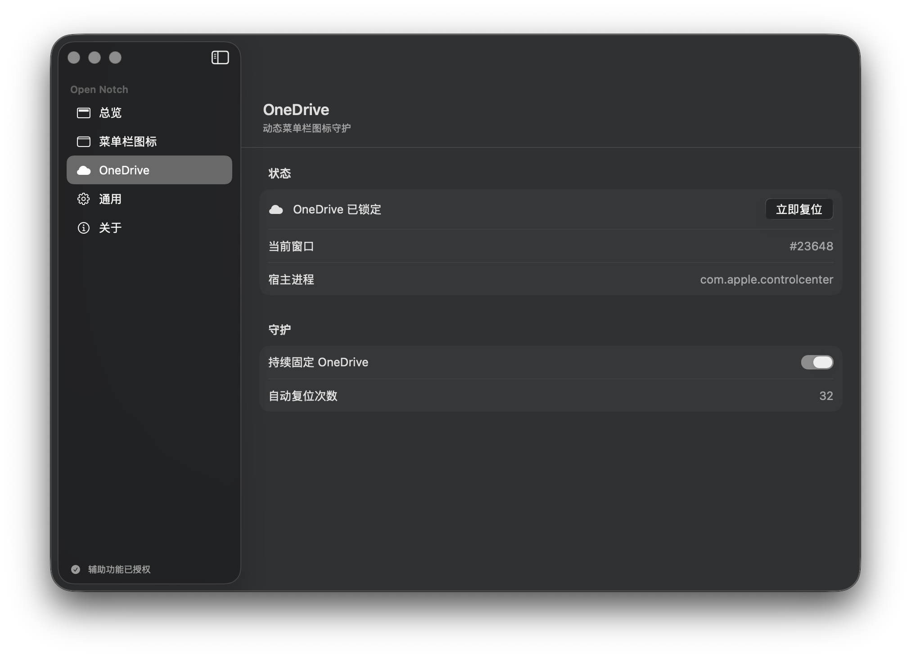
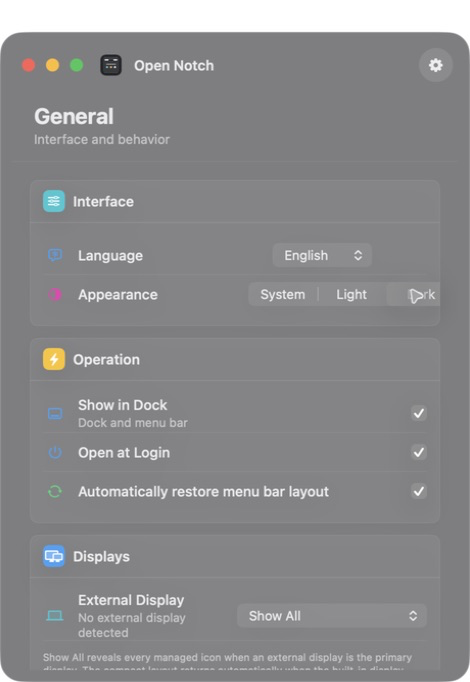

# Open Notch

Language: [简体中文](README.md) | English

[](https://www.apple.com/macos/)
[](https://www.swift.org/)
[](LICENSE)
[](https://github.com/woniuniuniu/open-notch)

**Take control of your Mac menu bar. Open source, native, and built to keep OneDrive in place.**

Open Notch is a fully open-source **menu bar manager for Mac**. Hide, show, and organize menu bar icons, keep important items where they belong, and make your menu bar clean and useful again.

It is a tribute to Bartender and Ice, with its core features built from scratch as an independent open-source project.

## Screenshots

These images were captured from the running app and cover both languages and appearance modes:

<table>
  <tr>
    <td width="50%"></td>
    <td width="50%"></td>
  </tr>
  <tr>
    <td align="center">中文 · Light · Overview</td>
    <td align="center">English · Light · Menu Bar Items</td>
  </tr>
  <tr>
    <td width="50%"></td>
    <td width="50%"></td>
  </tr>
  <tr>
    <td align="center">中文 · Dark · OneDrive guardian</td>
    <td align="center">English · Dark · General</td>
  </tr>
</table>

## Why Open Notch

Starting with macOS 15 Sequoia, Apple kept changing how the menu bar works. Many existing tools broke overnight, and developers had to race to catch up.

For years, Mac users have paid for different menu bar apps. Each one has its own ideas and technical approach, but there are not many open-source projects where everyone can maintain the product and make it better together.

So we asked a simple question: **why not open-source it?**

We used AI to vibe-code the core of Open Notch from scratch. The code is open, the issues are open, and the roadmap is open. Anyone can use it for free or help improve it. Its first job is simple: make it easy for anyone to hide, show, and organize their menu bar icons.

The second problem came from OneDrive. I use it every day, but its menu bar icon often jumps around. Sometimes it gets hidden; sometimes it suddenly comes back. Many menu bar tools cannot identify it reliably. So we built a OneDrive guardian that tries to keep it pinned in place.

This is only the beginning. If people request a feature or report a problem, we will keep improving it. The goal is simple: **build the world's best open-source menu bar manager for Mac.**

## Tribute and boundaries

Open Notch learns from two excellent products:

- **[Bartender](https://www.macbartender.com/)** promises total control over the menu bar, bringing hiding, showing, search, and organization into one polished experience.
- **[Ice](https://icemenubar.app/)** describes itself as a powerful menu bar management tool and makes hiding, showing, and arranging menu bar items open source.

Open Notch pays tribute to their product direction and learns from the way they explain it. It contains no Bartender code, assets, or proprietary implementation. A small event-routing mechanism in `Sources/TargetedEventRouter.swift` is rewritten from Ice and retains full GPL-3.0 attribution in [`NOTICE.md`](NOTICE.md).

Open Notch is an independent implementation, not an official Bartender or Ice release, and it does not represent Apple, Microsoft, or OneDrive.

## Features

- Discover, search, and manage menu bar items with Visible / Hidden states.
- Always Pinned items for keeping essentials in the visible menu bar area.
- Expand, collapse, and restore the hidden area.
- OneDrive dynamic menu bar guardian with a manual **Reset Now** action.
- Status item menu with expand, scan, settings, restart, and quit actions.
- English by default, with manual Simplified Chinese switching.
- Light and Dark appearance modes.
- Open at Login and automatic layout restoration.
- Accessibility status check with a direct System Settings shortcut.

Apple calls the strip at the top of the Mac screen the **menu bar**, and the icons on its right side **menu bar items**. That is why “menu bar manager” is the clearest English description of Open Notch.

## How it works

The monitor observes status item state. The layout reconciler requests a move only after consecutive observations confirm a mismatch. The move engine performs one bounded Accessibility Command-drag transaction and defers while the user is interacting with the mouse or keyboard. Monitoring does not continuously control the pointer and does not simulate random pointer movement.

On macOS 26, OneDrive may be temporarily hosted by Control Center and lose stable Accessibility semantics. Open Notch combines the semantic OneDrive bundle identifier, live geometry, and persisted local bindings to recover the logical identity. Anonymous Control Center windows are not presented as manageable items.

## Requirements

- Apple silicon Mac
- macOS 14 or later (validated on macOS 26)
- Accessibility access for Open Notch in System Settings > Privacy & Security > Accessibility

Accessibility is the macOS system boundary that allows an app to inspect other processes' status items and perform an explicit drag transaction. Open Notch does not use it to read keystrokes, mouse trails, or data from other applications.

## Install and first run

The repository includes a reproducible local build. Clone the source and run:

```zsh
git clone https://github.com/woniuniuniu/open-notch.git
cd open-notch
./build.sh
```

The script creates `build/Open Notch.app` and `build/Open Notch.zip`. Move the app to `/Applications`, launch it, grant Accessibility access in System Settings, and click **Recheck** on the General page.

The local build is ad-hoc signed for development and personal testing. Distribution to other users requires your own Developer ID signature and Apple notarization.

Do not run Ice, Bartender, or another menu bar manager at the same time. Multiple managers will try to move the same status items and make each other's policies and diagnostics unreliable.

## Development

Open Notch uses Apple Command Line Tools and does not require a committed full Xcode project:

```zsh
./build.sh
```

Project layout:

```text
Sources/OpenNotchApp.swift       app entry point and status item menu
Sources/SettingsView.swift       native SwiftUI settings UI
Sources/MenuBarDiscovery.swift   menu bar discovery and identity resolution
Sources/LayoutReconciler.swift   policy and OneDrive recovery coordination
Sources/MenuBarMoveEngine.swift  bounded Accessibility move transaction
Sources/TargetedEventRouter.swift Ice-derived event-routing compatibility layer
Resources/*.lproj                English / Simplified Chinese localization
Tools/make_icon.swift             app icon generation
build.sh                          reproducible build, signing, and packaging
```

## Privacy and security

Open Notch makes no network requests and collects no analytics or telemetry. Preferences and identity bindings remain in the local `UserDefaults` store. Accessibility is used only for menu bar discovery, the necessary window geometry, and the explicit Command-drag described above.

Do not upload Accessibility dumps, screenshots, personal paths, credentials, or other machine-specific data to issues or pull requests. See [`SECURITY.md`](SECURITY.md) for vulnerability reports.

## Compatibility and known constraints

- macOS does not expose a stable cross-process status item ordering API, so OS updates or host-app rebuilds can still affect behavior.
- Only one menu bar manager should run at a time.
- Some system or third-party items have no readable icon name. Open Notch shows the confirmed bundle identifier and avoids treating anonymous Control Center windows as items.
- The current script targets Apple silicon. Intel users need to adjust the compiler target in `build.sh` before building.

## FAQ

### Why is Accessibility required?

It is the macOS permission boundary for observing and dragging status items owned by other processes. Without it, Open Notch can show its settings UI but cannot reliably manage other apps' icons.

### Does Open Notch control the mouse continuously?

No. Read-only discovery and monitoring do not synthesize mouse events. A bounded Command-drag is performed only after a mismatch is confirmed and only when the user is not interacting.

### Why does OneDrive need special handling?

Newer macOS releases can dynamically host OneDrive's status item in Control Center, changing its window number and title. Open Notch restores the identity using semantic matching and persisted bindings instead of treating each transient window as a new item.

### Can I run it with Ice or Bartender?

It is not recommended. All of these tools may attempt to change the same status item positions, so there is no reliable way to predict which policy wins.

## License, attribution, and redistribution

The Open Notch project is released under **GNU General Public License v3.0-only (GPL-3.0-only)**. Read the complete text in [`LICENSE`](LICENSE). When you redistribute or modify Open Notch:

1. Preserve GPL, copyright, warranty-disclaimer, and third-party attribution notices.
2. Mark modified versions with the changes and the relevant date.
3. Provide the corresponding source, build script, and license text under GPL-3.0.
4. The Ice-derived portion of `Sources/TargetedEventRouter.swift` remains subject to Ice's copyright and GPL attribution requirements.

Ice source details:

- Project: https://github.com/jordanbaird/Ice
- Upstream file: `Ice/MenuBar/MenuBarItems/MenuBarItemManager.swift`
- Copyright: Copyright (C) 2024-2025 Jordan Baird

Bartender is proprietary software and is referenced only as product inspiration. Open Notch contains no Bartender source code. Open Notch is provided as-is, without any express or implied warranty.

## Contributing

Issues, documentation improvements, and pull requests are welcome. Please read [`CONTRIBUTING.md`](CONTRIBUTING.md), [`CODE_OF_CONDUCT.md`](CODE_OF_CONDUCT.md), and [`NOTICE.md`](NOTICE.md) first.

Repository: https://github.com/woniuniuniu/open-notch
