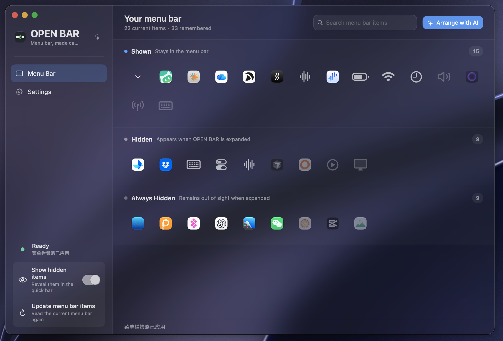
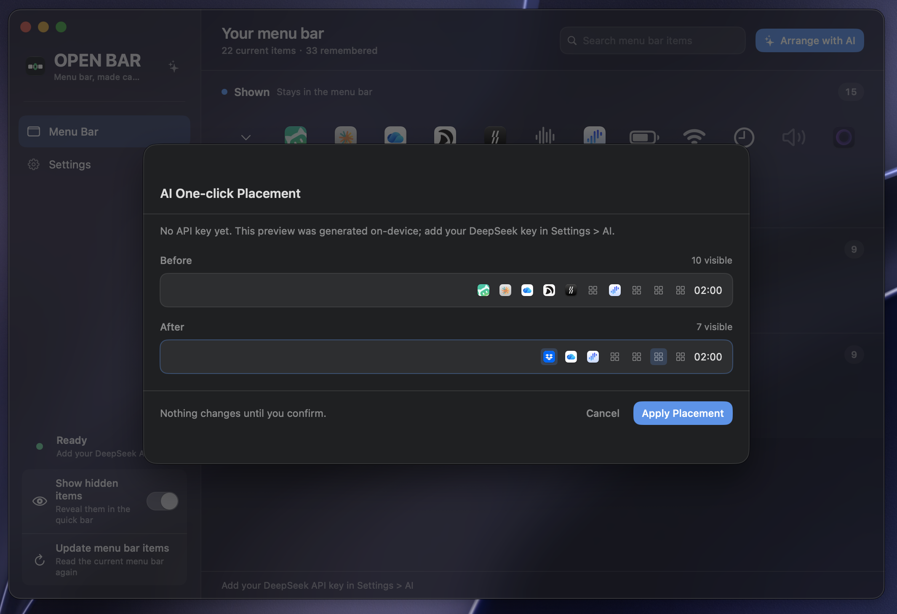
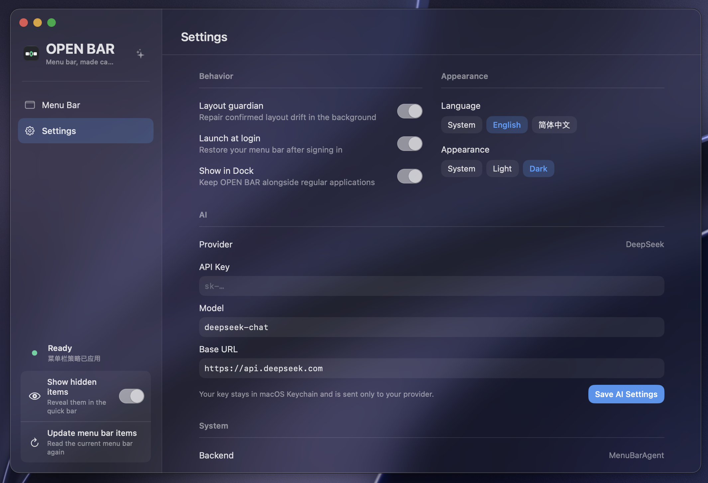
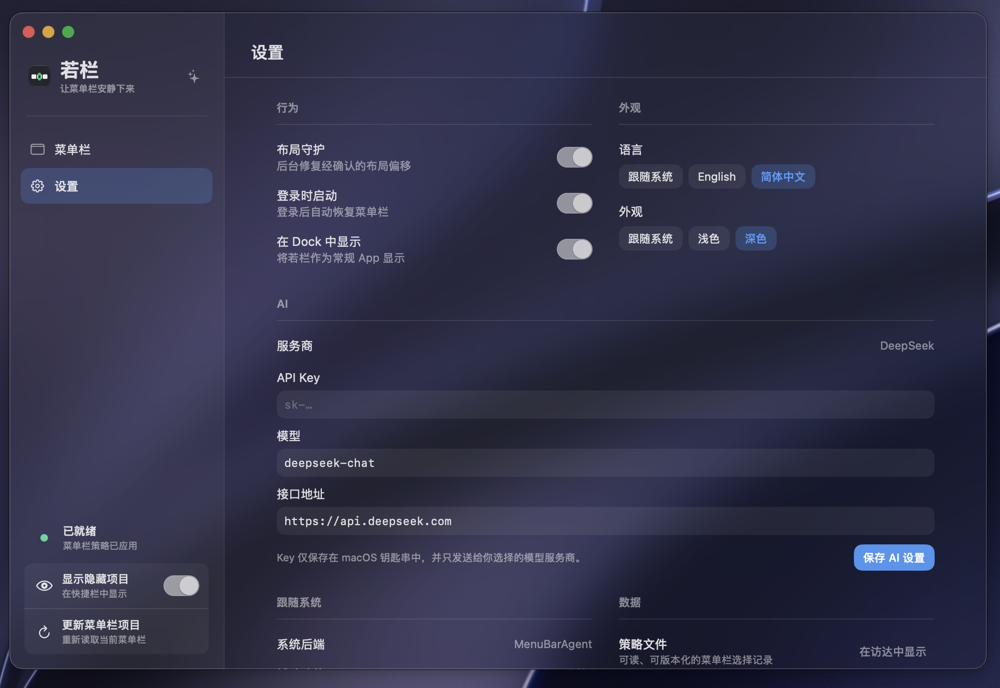

# OPEN BAR · 若栏

### A little less clutter. A calmer menu bar.

Keep everyday controls in sight. Tuck the rest away until you need them.

[简体中文](README.md) · **English**

[Download](https://github.com/woniuniuniu/open-bar/releases/latest) · [See how it works](#three-steps-to-a-calmer-menu-bar) · [Report an issue](https://github.com/woniuniuniu/open-bar/issues)

## More apps shouldn't mean more clutter

Sync tools, screenshot apps, clipboard managers, remote access utilities. Useful apps add up—and so do their icons in the top-right corner of your Mac.

**OPEN BAR is a native Mac app for organizing your menu bar.** Drag icons into three sections to choose what stays visible, what appears on demand, and what stays tucked away. Your apps keep running. Your menu bar gets some room to breathe.

| Keep it in sight | Bring it back when needed | Leave it tucked away |
| :--- | :--- | :--- |
| **Shown**: everyday controls and status you want to see. | **Hidden**: occasional tools, available when you expand OPEN BAR. | **Always Hidden**: stays out of the ordinary expanded view, too. |

## Easy to arrange. Easy to live with.

- **Drag to organize.** Move an icon to the section that fits. No elaborate rules to learn.
- **Reach for it when you need it.** Click OPEN BAR's menu bar arrow for a translucent Quick Bar. Right-click for the app's menu.
- **Start with a suggestion.** “Arrange with AI” offers a Before / After preview. Nothing changes until you confirm. On-device suggestions are available without an AI setup, too.
- **Keep your choices.** Third-party apps stay in your saved inventory while they're away. When detected again, they reuse their saved section.
- **Feel at home on your Mac.** A translucent interface, light and dark appearance, Chinese and English, and optional launch at login.

> OPEN BAR organizes menu bar entries. On macOS 27, the system's double-toggle control is called “Menu Bar.” Bluetooth, sound and display controls stay inside the system's own panel; OPEN BAR does not turn those panel controls into extra icons.

## Three steps to a calmer menu bar

### ① Take a look. Drag a few icons.

Open the app and place icons in the three sections. Search helps you find an app quickly. Dimmed third-party icons mean they weren't detected in the latest scan; their saved records are still there.

### ② Want a starting point? Preview a suggestion.

Choose **Arrange with AI** and compare Before and After. Apply a plan you like, cancel one you don't, or continue arranging by hand.

*This screenshot shows an on-device suggestion, not a result from a remote AI service. DeepSeek recommendations require your own API key, and provider charges may apply.*

### ③ Make it feel like yours.

Choose your language and appearance, then decide whether to launch at login. Close the main window when you're done: OPEN BAR can keep running in the menu bar. **⌘ W** closes the window, not the app.

<table>
<tr>
<td width="50%"></td>
<td width="50%"></td>
</tr>
<tr><td align="center">English</td><td align="center">简体中文</td></tr>
</table>

These are real screenshots from 1.1.0, presented as an illustrated walkthrough rather than a screen recording. Since 1.1.1, historical system modules without standalone menu bar buttons are no longer listed. Names, counts and appearance may differ in the current release.

## Download and get started

**For Apple silicon Macs running macOS 14 or later.** The current download does not include an Intel build.

1. Visit the [latest release](https://github.com/woniuniuniu/open-bar/releases/latest) and download `OPEN-BAR-version.zip`.
2. Unzip it, move **OPEN BAR.app** to Applications, and open it.
3. When prompted, allow OPEN BAR under **System Settings → Privacy & Security → Accessibility** so it can identify and manage menu bar items.
4. Return to OPEN BAR and start arranging.

**The current download is not Apple notarized and may be blocked by macOS on first launch.** This is a limitation of the current distribution. Developers can also [build from source](docs/DEVELOPMENT.md).

## A few useful answers

**Do I need AI to use it?**  
No. Manual organization, Quick Bar and saved records do not need an AI key. If a key isn't configured or the remote service is unavailable, the preview is clearly labeled as an on-device suggestion.

**Does it upload my data?**  
Everyday discovery and saved sections are handled locally. Only when you actively request remote AI arrangement does the app send item names, application identifiers, sections, and Mac model and display information to your configured provider. Your API key is stored in macOS Keychain.

**Does hiding an icon quit its app?**  
No. OPEN BAR changes the visibility of menu bar entries; it does not quit the apps behind them.

**Can I use it alongside another menu bar manager?**  
Use one at a time to avoid competing changes. Available controls vary across macOS versions. On macOS 27, multiple buttons belonging to one application share visibility settings.

**Can I freely reorder icons left to right?**  
Dragging in OPEN BAR changes visibility sections. Left-to-right order follows the actual menu bar; arbitrary ordering across macOS versions is not promised.

---

[Download OPEN BAR](https://github.com/woniuniuniu/open-bar/releases/latest) · [Changelog](CHANGELOG.md) · [Report an issue](https://github.com/woniuniuniu/open-bar/issues) · [Development](docs/DEVELOPMENT.md)

If OPEN BAR makes your Mac a little calmer, a Star is appreciated. Ideas and feedback are welcome, too.
