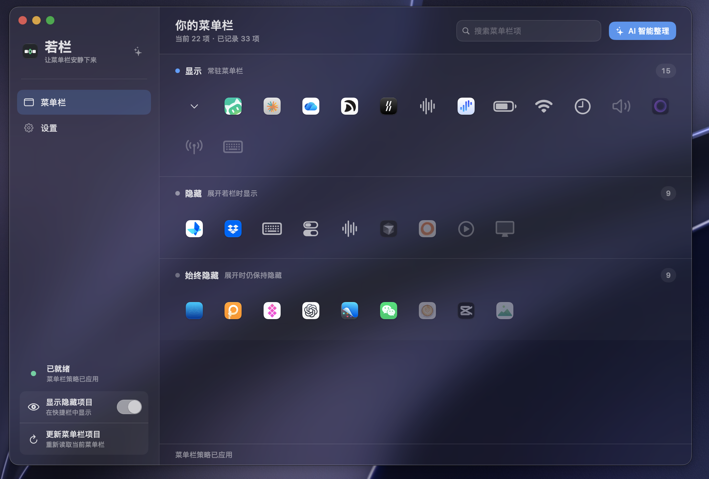
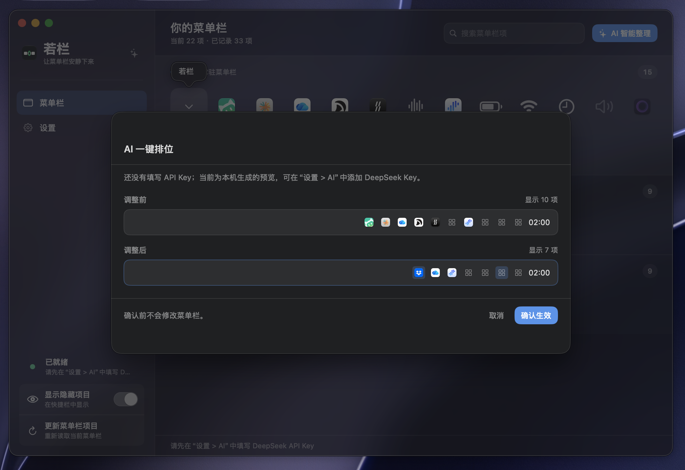

# 若栏 · OPEN BAR

### 让菜单栏安静下来。

常用的留下，偶尔用的收好。把 Mac 顶部的空间，还给真正重要的事。

**简体中文** · [English](README.en.md)

[下载最新版](https://github.com/woniuniuniu/open-bar/releases/latest) · [图解演示](#三步整理好你的菜单栏) · [反馈问题](https://github.com/woniuniuniu/open-bar/issues)

## 图标越来越多，菜单栏不必越来越挤

同步工具、截图软件、剪贴板、远程控制……装的软件多了，Mac 右上角也慢慢排成了一长串。

**若栏是一个原生 Mac 菜单栏整理工具。** 把图标拖进三个区域，就能决定哪些一直显示、哪些需要时再展开、哪些平时不出现。软件照常运行，你看到的菜单栏更清爽。

| 常用的，留在眼前 | 偶尔用的，随手展开 | 不需要的，安静收起 |
| :--- | :--- | :--- |
| **显示**：保留需要随时查看的状态和入口。 | **隐藏**：需要时从若栏展开，不必一直占空间。 | **始终隐藏**：普通展开时也不会冒出来。 |

## 简单整理，也能多替你想一步

- **拖一拖，就分好了。** 不用研究复杂规则，直接把图标放进合适的区域。
- **需要时，一点就到。** 点击菜单栏里的若栏箭头，打开半透明快捷栏；右键打开操作菜单。
- **不想逐个挑？先看整理建议。** “AI 智能整理”生成调整前后的预览，你确认后才生效。没有配置 AI，也能使用本机整理建议。
- **记住你的选择。** 第三方软件暂时退出，历史记录仍在；再次检测到时，继续沿用保存的分区。
- **自然融入 Mac。** 半透明界面、浅色与深色外观，中英文切换，还能设置登录时启动。

> 若栏管理的是菜单栏入口。系统双胶囊按钮在 macOS 27 中显示为“菜单栏”；点开后，蓝牙、声音、显示器等仍在系统自己的面板里。若栏不会把这些面板选项拆成一排额外图标。

## 三步，整理好你的菜单栏

### ① 看一眼，拖一拖

打开若栏，在三个区域里安排图标。搜索可以帮你快速找到目标；变淡的第三方图标表示本次暂未检测到，保存的记录仍然在。

### ② 想省点心，就看看建议

点击 **AI 智能整理**，比较“调整前”和“调整后”。喜欢就确认，不喜欢就取消，也可以继续自己拖动。

*图中是本机生成的建议，不是远端 AI 的实测结果。使用 DeepSeek 时，需要在设置中填写自己的 API Key，模型服务可能产生费用。*

### ③ 调成你喜欢的样子

选择语言和外观，决定是否登录时启动。之后关闭主窗口，若栏也能继续在菜单栏里工作；**⌘ W** 只关闭窗口。

<table>
<tr>
<td width="50%"></td>
<td width="50%"></td>
</tr>
<tr><td align="center">简体中文</td><td align="center">English</td></tr>
</table>

以上是 1.1.0 的真实界面截图，用于图解演示，并非操作录像。1.1.1 起，不再列出没有独立菜单栏按钮的历史系统子模块；项目名称、数量与外观以当前版本为准。

## 下载与开始使用

**适用于 M 系列芯片的 Mac，macOS 14 或更新版本。** 当前下载包不包含 Intel 版本。

1. 打开 [最新版本下载页](https://github.com/woniuniuniu/open-bar/releases/latest)，下载 `OPEN-BAR-版本号.zip`。
2. 解压，把 **OPEN BAR.app** 放进“应用程序”文件夹，然后打开。
3. 按提示前往 **系统设置 → 隐私与安全性 → 辅助功能**，允许 OPEN BAR 识别和管理菜单栏项目。
4. 回到若栏，开始整理。

**当前安装包尚未经过 Apple 公证，首次打开可能被 macOS 拦截。** 这是当前发布版本的限制；有开发经验的用户也可以选择[从源码构建](docs/DEVELOPMENT.md)。

## 你可能想知道

**不用 AI，也能用吗？**  
可以。拖动分区、快捷栏和本地记录都不需要 AI 密钥。未配置密钥或远端服务不可用时，整理预览会明确标记为本机建议。

**我的数据会被上传吗？**  
日常扫描和分区记录在本机处理。只有主动使用远端 AI 整理时，才会向你配置的服务发送菜单栏项目名称、应用标识、分区以及 Mac 型号和屏幕信息。API Key 保存在 macOS 钥匙串中。

**隐藏图标会退出软件吗？**  
不会。若栏改变的是菜单栏入口的显示方式，不负责退出对应软件。

**能和其他菜单栏整理软件一起开吗？**  
建议一次只运行一个，避免不同软件同时修改同一组图标。不同 macOS 版本可控制的项目也可能不同；同一应用的多个按钮在 macOS 27 上会一起显示或隐藏。

**可以自由调整左右顺序吗？**  
若栏的拖动用于改变显示分区。图标左右顺序跟随真实菜单栏，不承诺跨版本的任意排序。

---

[下载若栏](https://github.com/woniuniuniu/open-bar/releases/latest) · [查看更新](CHANGELOG.md) · [报告问题](https://github.com/woniuniuniu/open-bar/issues) · [开发说明](docs/DEVELOPMENT.md)

如果若栏让你的 Mac 清爽了一点，欢迎给项目一个 Star，也欢迎带着建议回来。
