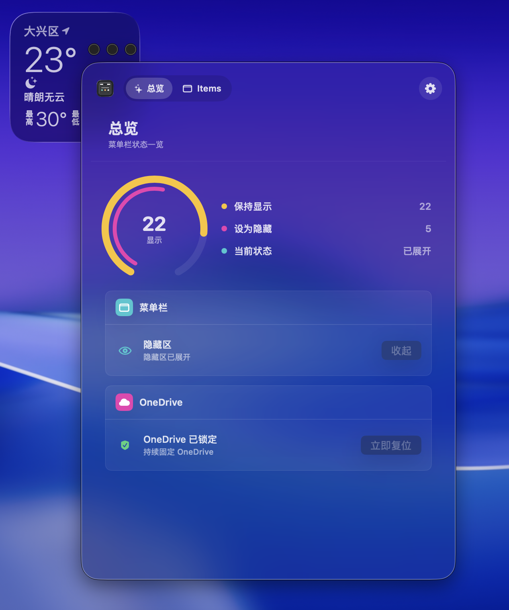
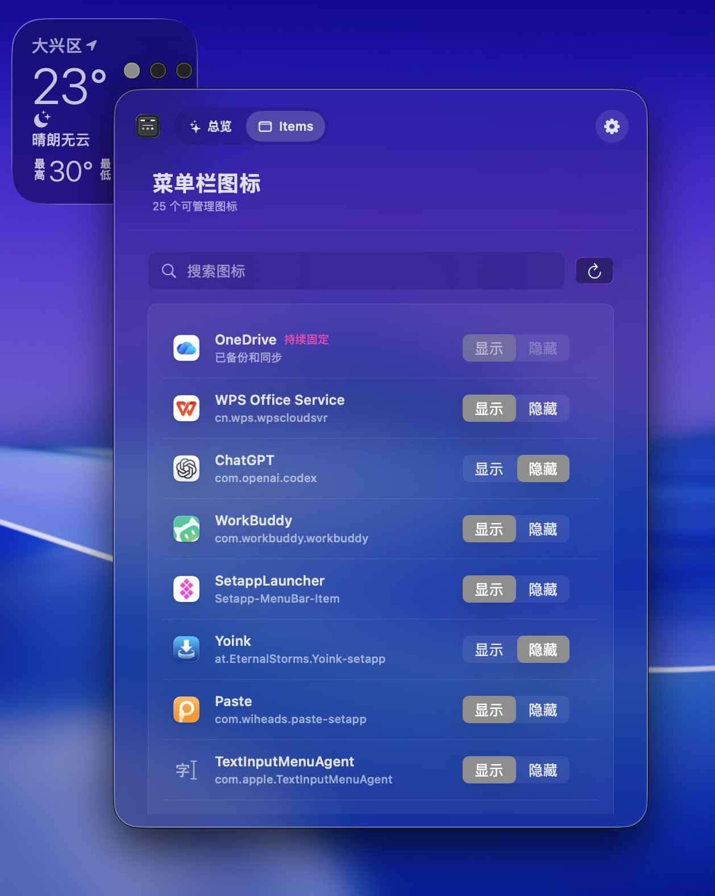

# Open Notch（开放刘海）

语言：简体中文 | [English](README.en.md)

[](https://www.apple.com/macos/)
[](https://www.swift.org/)
[](LICENSE)
[](https://github.com/woniuniuniu/open-notch)

**整理你的 Mac 菜单栏。开源、原生，也能把 OneDrive 稳稳钉住。**

Open Notch 是一个完全开源的 **Mac 菜单栏管理工具**。它可以隐藏、显示和整理菜单栏图标，让常用图标留在该在的位置，让你的 Mac 顶栏重新变得干净、好用。

它致敬 Bartender 和 Ice，主体功能从零开始开发，是一个独立的开源项目。

## 界面预览

截图来自新版 Open Notch 的真实运行界面：

<table>
  <tr>
    <td width="50%"></td>
    <td width="50%"></td>
  </tr>
  <tr>
    <td align="center">总览</td>
    <td align="center">菜单栏图标管理</td>
  </tr>
</table>

## 为什么做 Open Notch

从 macOS 15 Sequoia 开始，苹果连续调整菜单栏相关机制。很多原本好用的工具突然失效，开发者只能不断追着系统更新。

过去这些年，Mac 用户习惯花钱购买各种菜单栏工具。每个产品都有自己的方向和技术路线，但真正能让大家一起维护、一起把它做强的开源选择并不多。

所以我们想得很简单：**为什么不直接开源？**

我们用 AI，从零 vibe coding 了 Open Notch 的主体功能。代码公开、问题公开、路线也公开。任何人都可以免费使用，也可以一起改进。它要做的第一件事，就是让普通用户可以简单地隐藏、显示和整理自己的菜单栏图标。

第二个问题来自 OneDrive。我自己长期使用 OneDrive，但它的菜单栏图标经常跳来跳去：有时被隐藏，有时又自己跑出来，很多菜单栏工具都无法稳定识别。所以我们又做了 OneDrive 守护功能，尽可能把它“锁”在菜单栏里。

这只是开始。只要大家愿意提需求、报问题，我们就会继续更新。目标也很直接：**把 Open Notch 做成世界上最好用的开源 Mac 菜单栏管理工具。**

## 致敬与项目边界

Open Notch 向两个优秀产品学习：

- **[Bartender](https://www.macbartender.com/)** 强调“掌控你的菜单栏”，让隐藏、显示、搜索和整理菜单栏图标成为一套完整体验。
- **[Ice](https://icemenubar.app/)** 把自己定义为一款强大的菜单栏管理工具，并把隐藏、显示、排列图标等能力做成了开源项目。

Open Notch 致敬它们的产品方向，也认真学习它们的表达方式。我们没有复制 Bartender 的代码、资源或专有实现。`Sources/TargetedEventRouter.swift` 中有一小部分事件路由机制改写自 Ice，并按照 GPL-3.0 保留了完整归属，详见 [`NOTICE.md`](NOTICE.md)。

Open Notch 是独立实现，不是 Bartender 或 Ice 的官方版本，也不代表 Apple、Microsoft 或 OneDrive。

## 功能

- 菜单栏项目发现、搜索以及 Visible / Hidden 管理。
- Always Pinned 项目：常用项目可以保持在菜单栏可见区域。
- 隐藏区展开、收起和恢复。
- OneDrive 动态菜单栏图标守护与手动“立即复位”。
- 菜单栏图标菜单：展开隐藏区、扫描项目、打开设置、重启 Open Notch、退出。
- 默认英文，可手动切换简体中文。
- Light / Dark 外观模式。
- 登录时打开与自动恢复菜单栏布局。
- 辅助功能权限状态检查和系统设置快捷入口。

在 Apple 的官方语境里，Mac 屏幕顶部叫 **菜单栏（menu bar）**，右侧这些图标叫 **菜单栏项目（menu bar items）**。中文用户也常把它叫作状态栏或顶栏，所以你也可以把 Open Notch 理解为 Mac 状态栏图标管理工具。

## 工作方式

Open Notch 的持续监测负责**观察**菜单栏项目；布局协调器只有在连续观察确认布局偏差后，才会请求移动。移动使用一次范围明确的 Accessibility Command-拖动事务，并在用户正在使用鼠标或键盘时延后。监测本身不会持续控制鼠标，也不会模拟随机鼠标移动。

macOS 26 中，OneDrive 的状态项可能暂时由 Control Center 托管并失去稳定的 Accessibility 语义。Open Notch 会结合 OneDrive 的语义 Bundle Identifier、实时几何位置和本地持久绑定恢复逻辑身份；无法确认身份的匿名 Control Center 窗口不会被伪装成可管理项目。

## 使用要求

- Apple silicon Mac
- macOS 14 或更高版本（已针对 macOS 26 进行验证）
- 在“系统设置 > 隐私与安全性 > 辅助功能”中允许 Open Notch

辅助功能权限是 macOS 允许应用读取其他进程菜单栏项目并执行明确拖动事务的系统入口。Open Notch 不会借此读取键盘内容、鼠标轨迹或其他应用的数据。

## 安装与首次运行

仓库当前提供可复现的本地构建流程。下载源码后运行：

```zsh
git clone https://github.com/woniuniuniu/open-notch.git
cd open-notch
./build.sh
```

脚本会生成 `build/Open Notch.app` 和 `build/Open Notch.zip`。将 App 移到 `/Applications` 后启动，在系统设置中授予辅助功能权限，再回到 Open Notch 的 General / 通用页面点击 **Recheck / 重新检查**。

本地构建使用 ad-hoc 签名，仅适合开发和个人测试。面向其他用户分发时，需要使用自己的 Developer ID 签名并完成 Apple notarization。

不要同时运行 Ice、Bartender 或其他菜单栏管理器；多个工具会互相移动状态栏项目，导致布局和权限诊断失真。

## 开发

项目只需要 Apple Command Line Tools，不要求提交一个完整的 Xcode 工程：

```zsh
./build.sh
```

主要目录：

```text
Sources/OpenNotchApp.swift       应用入口与状态栏菜单
Sources/SettingsView.swift       原生 SwiftUI 设置界面
Sources/MenuBarDiscovery.swift   菜单栏项目发现与身份解析
Sources/LayoutReconciler.swift   布局策略与 OneDrive 恢复协调
Sources/MenuBarMoveEngine.swift  有界 Accessibility 移动事务
Sources/TargetedEventRouter.swift Ice-derived 事件路由兼容层
Resources/*.lproj                English / 简体中文本地化
Tools/make_icon.swift             应用图标生成
build.sh                          可复现构建、签名与打包
```

## 隐私与安全

Open Notch 不联网、不收集分析数据、不包含遥测或账号系统。设置和身份绑定只保存在本机 `UserDefaults`。辅助功能仅用于发现菜单栏项目、读取必要的窗口几何信息，以及执行上文说明的明确 Command-拖动。

请不要在 issue 或 pull request 中上传 Accessibility dump、屏幕截图、个人路径、凭据或其他机器特有信息。安全问题请参阅 [`SECURITY.md`](SECURITY.md)。

## 兼容性与已知限制

- macOS 不提供稳定的跨进程状态栏排序 API，因此系统更新或宿主应用重构仍可能改变行为。
- 一次只能运行一个菜单栏管理器。
- 某些系统或第三方项目可能没有可读的图标名称；Open Notch 会显示可确认的 Bundle Identifier，并避免把匿名 Control Center 窗口误报为项目。
- 应用目前面向 Apple silicon 构建；Intel Mac 需要调整 `build.sh` 的编译目标后自行构建。

## 常见问题

### 为什么必须开启辅助功能？

这是 macOS 对跨进程状态栏项目观察和拖动操作的系统授权。没有授权时，Open Notch 只能展示设置界面，不能可靠地管理其他应用的图标。

### Open Notch 会一直控制鼠标吗？

不会。只读发现和监测不合成鼠标事件；只有布局偏差被确认、且用户没有正在交互时，才会执行一次有界的 Command-拖动。

### 为什么 OneDrive 需要单独处理？

新版 macOS 可能让 OneDrive 菜单栏项由 Control Center 动态托管，窗口编号和标题会变化。Open Notch 用语义身份和持久绑定恢复它，而不是把临时窗口当成新项目。

### 可以和 Ice 或 Bartender 一起运行吗？

不建议。它们都会尝试改变同一组状态栏项目的位置，无法保证哪个工具的策略最终生效。

## 许可证、归属与再发布义务

Open Notch 项目整体使用 **GNU General Public License v3.0-only (GPL-3.0-only)**，完整文本见 [`LICENSE`](LICENSE)。如果你再发布或修改 Open Notch：

1. 保留 GPL、版权、无担保和第三方归属声明。
2. 对修改后的版本明确标注修改内容和日期。
3. 按 GPL-3.0 提供对应源代码、构建脚本和许可证文本。
4. `Sources/TargetedEventRouter.swift` 的 Ice 衍生部分继续适用 Ice 的版权和 GPL 归属要求。

Ice 来源信息：

- 项目：https://github.com/jordanbaird/Ice
- 上游文件：`Ice/MenuBar/MenuBarItems/MenuBarItemManager.swift`
- 版权：Copyright (C) 2024-2025 Jordan Baird

Bartender 是专有软件；它只是产品方向上的灵感来源，Open Notch 不包含 Bartender 源代码。Open Notch 按现状提供，不提供任何明示或暗示担保。

## 参与贡献

欢迎提交 issue、改进建议和 pull request。请先阅读 [`CONTRIBUTING.md`](CONTRIBUTING.md)、[`CODE_OF_CONDUCT.md`](CODE_OF_CONDUCT.md) 和 [`NOTICE.md`](NOTICE.md)。

项目地址：https://github.com/woniuniuniu/open-notch
